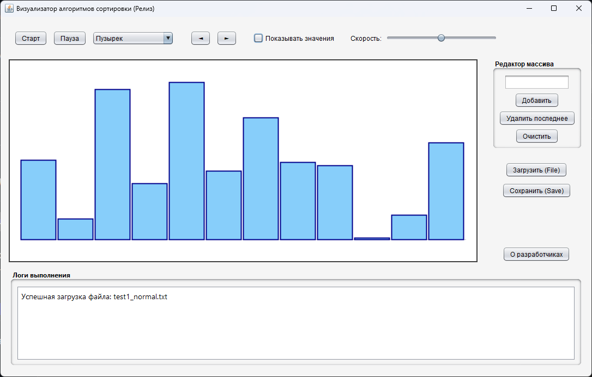
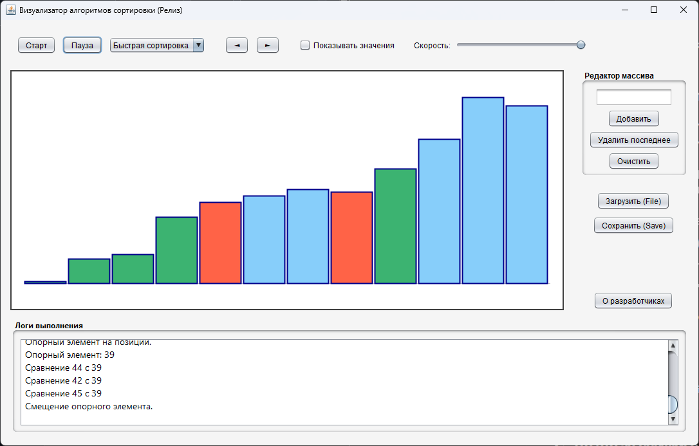
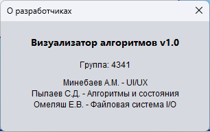
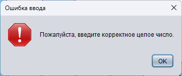

# 📊 Визуализатор алгоритмов сортировки


Десктопное приложение для интерактивной пошаговой визуализации работы классических алгоритмов сортировки. Проект разработан в рамках летней учебной практики СПбГЭТУ «ЛЭТИ».

## 👥 Команда разработчиков
**Группа:** 4341 | **Бригада:** 9

* **Омеляш Е.В.** — Файловая система (I/O), парсинг данных, обработка исключений.
* **Пылаев С.Д.** — Реализация алгоритмов сортировки, архитектура приложения (паттерн State/Снимок).
* **Минебаев А.М.** — UI/UX дизайн, графический движок на Swing, анимации.

---

## ✨ Основной функционал

* 🧮 **Поддерживаемые алгоритмы:**
  * Сортировка пузырьком (Bubble Sort)
  * Сортировка вставками (Insertion Sort)
  * Быстрая сортировка (Quick Sort)
* 🎞️ **Пошаговая симуляция:** Паттерн *Снимок (Memento/State)* позволяет не только автоматически проигрывать алгоритм, но и свободно перемещаться на шаг вперед (`►`) и назад (`◄`).
* 🎨 **Умная цветовая индикация:**
  * 🟥 **Красный** — элементы, сравниваемые на текущем шаге.
  * 🟩 **Зеленый** — элементы, занявшие свою финальную (отсортированную) позицию.
  * 🟦 **Светло-голубой** — необработанные элементы.
* 📈 **Продвинутая графика:** Поддержка отрицательных чисел с автоматической отрисовкой оси $Y=0$, опциональное отображение числовых значений над столбцами, адаптивный скроллинг для больших массивов.
* ✍️ **Динамический редактор:** Добавление, удаление и очистка элементов массива прямо в интерфейсе программы без необходимости перезапуска.
* 💾 **Совместимость файлов:** Загрузка массивов из `.txt` и экспорт итоговых результатов вместе с подробным пошаговым журналом (логами) событий.
* 🛡️ **Валидация:** Программа защищена от некорректного пользовательского ввода и "битых" файлов.

---

## 📸 Скриншоты интерфейса

| Главное окно (после загрузки массива) | Процесс сортировки (Быстрая сортировка) |
| :---: | :---: |
|  |  |
| **Окно «О разработчиках»** | **Обработка ошибок (валидация ввода)** |
|  |  |

---

## 🛠️ Архитектура проекта

Проект написан на чистом Java и строго разделен на логические пакеты:

```text
src/
 ├── algorithms/   # Логика алгоритмов сортировки
 ├── io/           # Парсинг и сохранение .txt файлов
 ├── model/        # Структуры данных и паттерн State (состояния)
 ├── ui/           # Графический интерфейс (Swing окна, панели, графика)
 └── main/         # Точка входа в приложение (Main.java)
